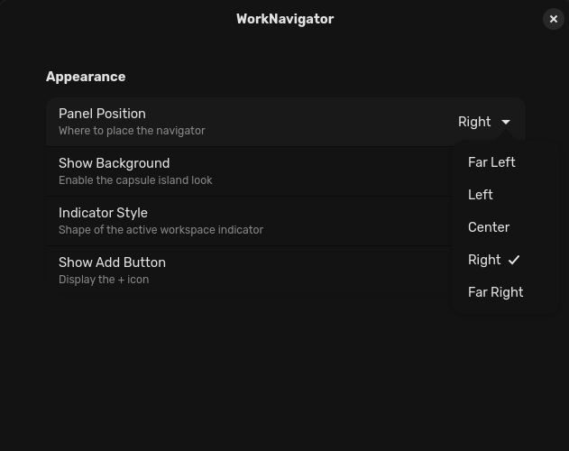
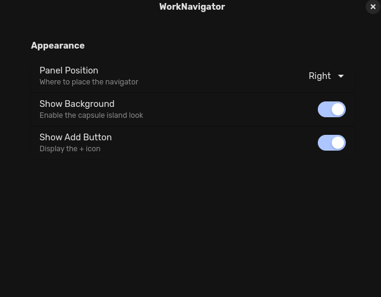
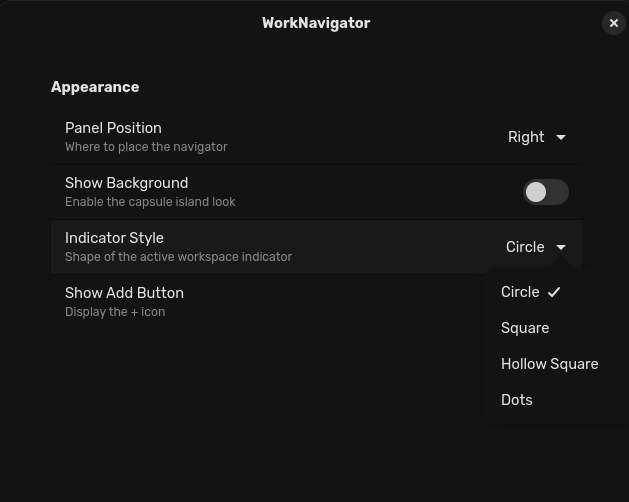

# WorkNavigator

**Professional workspace navigator with style options.**

WorkNavigator replaces the standard workspace indicator with a customizable, stylish navigator. It fully supports GNOME 45 through 49.

## Features
* **Customizable Position:** Place the navigator Left, Center, or Right.
* **Visual Styles:** Choose between Circle, Square, Hollow Square, or Dots.
* **Capsule Background:** Toggle a "Dynamic Island" style background.

## Screenshots

### Styles
| With Background | No Background (Circle) |
| :---: | :---: |
|  |  |

| Square | Hollow Square | Dots |
| :---: | :---: | :---: |
|  |  |  |

### Customization Settings
| Preferences Panel | Toggle Background | Indicator Style |
| :---: | :---: | :---: |
|  |  |  |

## Installation

### From Source
1. Clone this repository:
    ```bash
    git clone [https://github.com/OpalAayan/WorkNavigator.git](https://github.com/OpalAayan/WorkNavigator.git)
    cd WorkNavigator
    ```
2. Build and Install:
    ```bash
    gnome-extensions pack --force
    gnome-extensions install ./WorkNavigator@opalaayan-git.shell-extension.zip
    ```
3. Restart GNOME Shell (Log out/in or press `Alt+F2`, type `r`, enter on X11).
4. Enable the extension via **Extensions Manager**.
